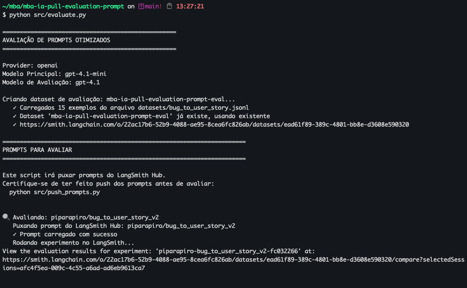
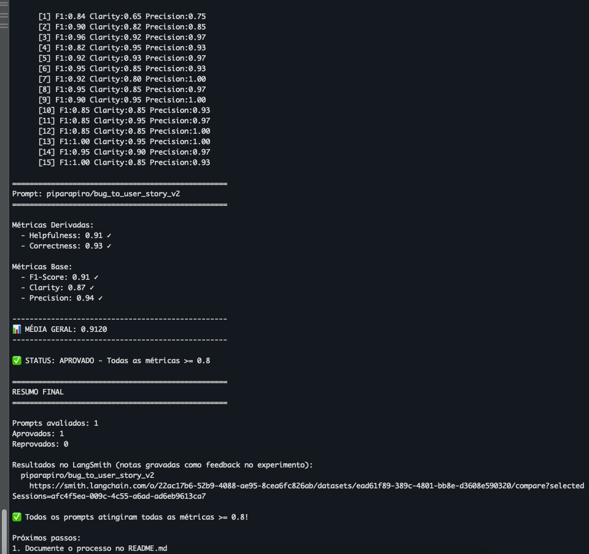
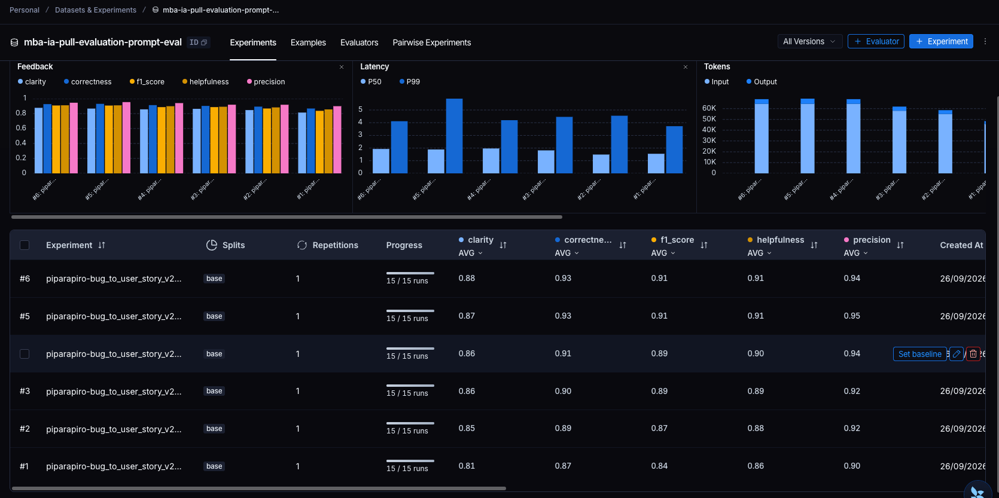

# Pull, Otimização e Avaliação de Prompts com LangChain e LangSmith

Projeto do MBA em Engenharia de Software com IA (Full Cycle). Parte de um prompt de baixa qualidade que converte relatos de bugs em User Stories (`bug_to_user_story_v1`), refatora esse prompt com técnicas de Prompt Engineering, publica a versão otimizada no LangSmith Prompt Hub e avalia o resultado com 5 métricas (LLM-as-judge) até **todas ficarem ≥ 0.8**.

> O enunciado original do desafio está em [`docs/DESAFIO.md`](docs/DESAFIO.md).

**Resultado final: aprovado, com média 0.91** (última execução, rodada 6)

| Métrica | Nota | Critério |
|---|---|---|
| Helpfulness | **0.91** ✓ | ≥ 0.8 |
| Correctness | **0.93** ✓ | ≥ 0.8 |
| F1-Score | **0.91** ✓ | ≥ 0.8 |
| Clarity | **0.87** ✓ | ≥ 0.8 |
| Precision | **0.94** ✓ | ≥ 0.8 |

- Prompt publicado: [`piparapiro/bug_to_user_story_v2`](https://smith.langchain.com/hub/piparapiro/bug_to_user_story_v2)
- Dataset de avaliação com todos os experimentos (link público): https://smith.langchain.com/public/92757ab0-ffaf-4e36-9809-3d6d6b4694b2/d

## Para o avaliador

- ▶️ Como executar o projeto → [Como Executar](#como-executar)
- 🧠 Técnicas usadas e por quê → [Técnicas Aplicadas](#técnicas-aplicadas-fase-2)
- 📊 Notas, evidências e v1 × v2 → [Resultados Finais](#resultados-finais)

Execução mínima, com o `.env` preenchido (veja [Configuração](#2-configuração)):

```bash
python3 -m venv venv && source venv/bin/activate
pip install -r requirements.txt
pytest tests/test_prompts.py -v   # valida a estrutura do prompt v2
python src/evaluate.py            # avalia o prompt publicado e imprime as 5 métricas
```

> **Dica:** para avaliar exatamente o prompt desta entrega, sem criar handle próprio nem fazer push, use `USERNAME_LANGSMITH_HUB=piparapiro` no `.env`. O `evaluate.py` faz o pull público de `piparapiro/bug_to_user_story_v2`. Para publicar a sua própria cópia, use o seu handle e rode `python src/push_prompts.py` antes da avaliação.

Outros documentos: [`PLANO.md`](PLANO.md) (plano, checklist de requisitos e log completo das iterações) · [`docs/DESAFIO.md`](docs/DESAFIO.md) (enunciado original).

---

## Técnicas Aplicadas (Fase 2)

### A lógica do design

Um bom prompt precisa responder a quatro perguntas. Escolhi uma técnica para cada uma:

| Pergunta | Técnica | O que ela define no prompt |
|---|---|---|
| **Quem fala?** | Role Prompting | Um Product Owner sênior que transforma bugs em histórias |
| **Como ele pensa?** | Chain of Thought (CoT) | Um roteiro de análise em 7 etapas, feito antes de escrever |
| **Como ele entrega?** | Skeleton of Thought | Um esqueleto de saída fixo, com três níveis de detalhe |
| **Com que modelo?** | Few-shot Learning (obrigatório) | 4 exemplos próprios que mostram o padrão na prática |

Cada técnica controla uma dimensão diferente da resposta, então elas se somam e não se sobrepõem.

### 1. Role Prompting: quem fala

**Por quê:** o v1 dizia apenas "você é um assistente que ajuda". Sem uma persona definida, o modelo não sabe qual vocabulário usar, qual nível de detalhe é esperado nem qual ponto de vista adotar. A tarefa pede o olhar de quem escreve histórias para um time de desenvolvimento, que é o papel de um PO.

**Como apliquei:**

```yaml
Você é um Product Owner sênior com mais de 10 anos de experiência em produtos digitais
(e-commerce, SaaS, mobile, ERP e CRM). Sua especialidade é transformar relatos de bugs
em User Stories claras, fiéis ao relato e prontas para o time de desenvolvimento
priorizar e implementar.
```

Os domínios citados são os mesmos do dataset. Assim a persona "conhece" os contextos que vai encontrar.

### 2. Chain of Thought: como ele pensa

**Por quê:** transformar um bug numa história não é só reescrever o texto. O modelo precisa responder, em ordem: quem é afetado, o que essa pessoa precisa, por que isso importa, quantos problemas existem e qual é o tamanho do bug. Pular essas etapas era o que gerava as histórias genéricas do v1 ("Como um usuário do sistema...").

**Como apliquei:** um roteiro de 7 etapas, com uma instrução explícita para **não mostrar a análise na resposta**:

```yaml
## Como analisar o relato (raciocine passo a passo, em silêncio)
Antes de escrever, percorra mentalmente estas etapas. NÃO escreva esta análise na resposta.
1. Quem é afetado? [...]
2. O que a persona precisa? Descreva o comportamento CORRETO esperado, e não o defeito.
3. Por que isso importa? [...]
4. Quantos problemas distintos existem? [...]
5. Que FATOS o relato traz? [...]
6. O que você, como PO, precisa PROPOR? [meta mensurável, tratamento de falha, prevenção, correção]
7. Classifique a complexidade: SIMPLES | MÉDIO | COMPLEXO
```

O raciocínio fica fora da resposta porque o avaliador de **Clarity** pune redundância e falta de concisão, e o de **Precision** pune conteúdo que não foi pedido. Uma análise visível derrubaria as duas notas, e com elas Helpfulness e Correctness, que são médias calculadas a partir delas.

### 3. Skeleton of Thought: como ele entrega

**Por quê:** as respostas de referência do dataset têm três formatos bem distintos, que acompanham a complexidade do bug:

| Complexidade | Tamanho da referência | Estrutura |
|---|---|---|
| Simples (5 bugs) | ~400 caracteres | história + critérios Dado/Quando/Então |
| Médio (7 bugs) | ~700–950 | + 1 ou 2 seções de apoio (Contexto Técnico, Exemplo de Cálculo, Prevenção…) |
| Complexo (3 bugs) | ~3.600–5.700 | seções `=== ... ===`, critérios agrupados A/B/C, critérios técnicos, tasks |

Um formato único seria longo demais para bugs simples (perde em Clarity, no quesito concisão) ou curto demais para os complexos (perde em F1, no quesito recall). O esqueleto define **o que entregar em cada nível**. A etapa 7 do raciocínio escolhe qual esqueleto usar.

**Como apliquei:**

```yaml
### Nível SIMPLES
Como um [persona], eu quero [comportamento esperado], para que [benefício].
Critérios de Aceitação:
- Dado que [contexto]
- Quando [ação]
- Então [resultado esperado]
- E [resultado complementar]

### Nível MÉDIO
Tudo do SIMPLES + 1 a 2 seções complementares + uma seção de contexto:
- Problema identificado / Situação atual / Esperado / Sugestão / Impacto

### Nível COMPLEXO
=== USER STORY PRINCIPAL === / === CRITÉRIOS DE ACEITAÇÃO === (A, B, C por problema)
=== CRITÉRIOS TÉCNICOS === / === CONTEXTO DO BUG === / === TASKS TÉCNICAS SUGERIDAS ===
```

### 4. Few-shot Learning: com que modelo

**Por quê:** é a técnica obrigatória do desafio e, como as iterações mostraram, **a que mais pesa no comportamento do modelo** (veja a rodada 3 → 4 em [Resultados](#evolução-por-iteração)).

**Como apliquei:** são 4 exemplos **escritos por mim, em domínios diferentes dos do dataset**, para ensinar o padrão sem "vazar" as respostas da avaliação:

| Exemplo | Nível | Domínio | O que ensina |
|---|---|---|---|
| Data do boleto no formato americano | simples | financeiro | resposta curta, só história + critérios |
| Consultas duplicadas no mesmo horário | médio | saúde | persona "o sistema", validação no ponto da falha, prevenção informativa, contexto técnico |
| Lista de estados cortada no Android | médio | cadastro | seção de acessibilidade em bug de interface |
| Rastreamento, frete e SMS com falhas | complexo | logística | todas as seções, um grupo de critérios por problema, cálculo preservado (R$ 125,00) |

Os exemplos **não ficam dentro do texto do system prompt**. O [`push_prompts.py`](src/push_prompts.py) transforma cada um num par real de mensagens `user → assistant`, colocado entre o system prompt e o bug:

```
system:     persona + raciocínio + esqueleto + regras
user:       [exemplo 1: relato]      assistant: [exemplo 1: história]
user:       [exemplo 2: relato]      assistant: [exemplo 2: história]
...
user:       {bug_report}
```

Assim o modelo "vê" conversas anteriores em que já respondeu no formato certo, que é como modelos de chat aprendem melhor.

### Técnica avaliada e descartada: ReAct

ReAct (*Reasoning + Acting*) intercala raciocínio com **ações em ferramentas externas** (buscar, consultar uma API, rodar código) e com a **observação** do resultado de cada ação. Este desafio não tem ferramenta nenhuma: entra um texto e sai um texto. Usar ReAct obrigaria o modelo a escrever blocos "Pensamento → Ação → Observação" de mentira, o que:
- polui a resposta com conteúdo que não é a User Story, e o **Clarity** cai;
- inventa ações e observações que não aconteceram, e o **Precision** cai.

O raciocínio de que a tarefa precisa já é coberto pelo CoT, sem esses custos.

### Regras de comportamento e casos especiais

Além das técnicas, o prompt tem 7 regras explícitas e 5 casos especiais. A regra mais importante surgiu na rodada 2:

> **Fatos × propostas.** FATOS sobre a situação atual (sintomas, números medidos, causa, impacto) vêm somente do relato: não invente nenhum e preserve os valores exatos. PROPOSTAS sobre a solução (comportamento esperado, metas, prevenção, tratamento de falha, correções técnicas) são responsabilidade do PO: defina-as de forma concreta e mensurável.

Casos especiais tratados: relato vago ou muito curto, vários problemas no mesmo relato, relato em outro idioma, relato com payload malicioso ou dados pessoais, e pedido de melhoria em vez de bug.

---

## Resultados Finais

### Evidências no LangSmith

- **Dataset de avaliação público** (15 exemplos + todos os experimentos, com o tracing de cada execução):
  https://smith.langchain.com/public/92757ab0-ffaf-4e36-9809-3d6d6b4694b2/d
- **Prompt publicado:** [`piparapiro/bug_to_user_story_v2`](https://smith.langchain.com/hub/piparapiro/bug_to_user_story_v2)

#### Screenshots

**Execução final do `evaluate.py`, com todas as métricas ≥ 0.8:**





**Experimentos no dashboard do LangSmith, comparando as iterações:**



O dataset com os 15 exemplos, as notas de cada execução e o **tracing detalhado de cada exemplo** (entrada, mensagens do few-shot, resposta e o comentário do avaliador para cada métrica) podem ser consultados no [link público do dataset](https://smith.langchain.com/public/92757ab0-ffaf-4e36-9809-3d6d6b4694b2/d): abra um experimento e clique em qualquer linha.

### Evolução por iteração

| # | O que mudou | F1 | Clarity | Precision | Helpful. | Correct. | Média |
|---|---|---|---|---|---|---|---|
| 1 | Primeiro rascunho: persona + raciocínio silencioso + esqueleto por complexidade + 3 exemplos | 0.84 | 0.81 | 0.90 | 0.86 | 0.87 | 0.85 |
| 2 | Separar **fatos** (não inventar) de **propostas** (metas, prevenção, correções) | 0.87 | 0.85 | 0.92 | 0.88 | 0.89 | 0.88 |
| 3 | Regras gerais: persona "o sistema", acessibilidade em bug de UI, validação no ponto da falha, contexto de segurança | 0.89 | 0.86 | 0.92 | 0.89 | 0.90 | 0.89 |
| 4 | Exemplos do few-shot alinhados às regras + novo exemplo de UI | 0.89 | 0.86 | 0.94 | 0.90 | 0.91 | 0.90 |
| 5 | Nenhuma mudança: reexecução para medir estabilidade | 0.91 | 0.87 | 0.95 | 0.91 | 0.93 | 0.91 |
| 6 | Nenhuma mudança: execução final, registrada nos screenshots | **0.91** | **0.87** | **0.94** | **0.91** | **0.93** | **0.91** |

Modelos usados: `gpt-4.1-mini` para gerar as respostas e `gpt-4.1` como avaliador, ambos com `temperature=0`.

**O que cada rodada ensinou:**

- **Rodada 1 → 2: o prompt estava mais rígido que as referências.** A regra "não invente nada" também impedia o modelo de *propor*. As referências propõem o tempo todo: metas ("gerar em menos de 30 segundos", quando o relato só dizia "mais de 2 minutos"), correções ("adicionar índice"), prevenção ("reservar estoque"). Nos bugs complexos, as respostas tinham cerca de 1.5 mil caracteres, contra 3.6 a 5.7 mil das referências. O juiz as chamava de "superficiais", e o recall (F1) caía. Separar fatos de propostas resolveu isso.
- **Rodada 3 → 4: exemplos pesam mais que instruções.** As regras novas da rodada 3 quase não mudaram as respostas, porque o exemplo médio do few-shot **contradizia** uma delas: usava "Como um paciente" num problema de concorrência, em que a regra pedia "o sistema". Além disso, nenhum exemplo mostrava um bug de interface. Quando alinhei os exemplos às regras, o bug do carrinho subiu de 0.85 para 0.95 em Clarity (e de 0.79 para 0.90 em F1), e o do modal subiu de 0.85 para 0.95 em Clarity.
- **Rodadas 5 e 6: estabilidade.** O mesmo prompt da rodada 4, rodado mais duas vezes, variou cerca de ±0.02, porque o próprio juiz (um LLM) tem alguma variação. Nas três execuções, todas as métricas ficaram ≥ 0.86, com folga sobre o mínimo de 0.8.

**Limitação conhecida:** em bugs de backend (ex.: endpoint sem validação de permissão), o modelo às vezes ainda escreve a persona como usuário, em vez de "o sistema". Não forcei a correção porque isso já não afeta a aprovação, e o próximo passo seria ajustar o prompt às respostas específicas do dataset, o que é *overfitting*, e não melhoria.

### Comparação v1 × v2

| Aspecto | v1 (original) | v2 (otimizado) |
|---|---|---|
| Persona | "um assistente que ajuda" | Product Owner sênior, com domínios definidos |
| System × User | `{bug_report}` **duplicado** no system e no user prompt | system prompt só com instruções; `{bug_report}` só na mensagem do usuário |
| Raciocínio | nenhum | roteiro de 7 etapas, sem aparecer na resposta |
| Formato | nenhum ("crie uma user story") | esqueleto em 3 níveis, critérios Dado/Quando/Então |
| Exemplos | nenhum | 4 exemplos como pares reais de mensagens |
| Regras | nenhuma | 7 regras explícitas (fatos × propostas, proporcionalidade, sem markdown, sem comentários…) |
| Casos especiais | nenhum | relato vago, vários problemas, outro idioma, payload malicioso, pedido de melhoria |

**Na prática: o mesmo bug e o mesmo modelo (`gpt-4.1-mini`)**

> *"Dashboard mostra contagem errada de usuários ativos. Mostra 50 mas só há 42 na lista."*

<table>
<tr><th>v1</th><th>v2</th></tr>
<tr><td valign="top">

```
**User Story:**

Como um usuário do sistema,
quero que o dashboard mostre a contagem
correta de usuários ativos,
para que as informações exibidas sejam
precisas e confiáveis.

**Critérios de Aceitação:**

- A contagem de usuários ativos no dashboard
  deve corresponder exatamente ao número de
  usuários listados como ativos.
- A contagem deve ser atualizada em tempo
  real ou conforme a atualização dos dados.
- Caso haja algum filtro aplicado na lista
  de usuários ativos, a contagem deve
  refletir esse filtro corretamente.
```

</td><td valign="top">

```
Como um administrador, eu quero que o
dashboard mostre a contagem correta de
usuários ativos, para que eu tenha
informações precisas para a tomada de
decisão.

Critérios de Aceitação:
- Dado que estou visualizando o dashboard
  de usuários ativos
- Quando a contagem é exibida
- Então o número mostrado deve corresponder
  exatamente à quantidade de usuários listados
- E a lista de usuários ativos deve conter
  todos os usuários contados
- E a contagem deve ser atualizada em tempo
  real ou ao atualizar a página

Contexto Técnico:
- Problema identificado: contagem incorreta
  (50 exibidos, 42 listados)
- Esperado: contagem e lista sincronizadas
- Sugestão: revisar a consulta da contagem
  para usar os mesmos critérios da lista
- Impacto: administradores recebem dados
  incorretos
```

</td></tr>
</table>

O v1 usa uma persona genérica ("usuário do sistema"), mistura markdown com texto, não segue o padrão Dado/Quando/Então e inventa um cenário que o relato não menciona (filtros). O v2 identifica a persona real (quem vê o dashboard é um administrador), segue o formato, preserva os números do relato (50 × 42) e propõe uma correção ligada à causa. Resultado do v2 neste exemplo: Precision 1.00, Helpfulness 0.93 e Correctness 0.92.

---

## Como Executar

### Pré-requisitos

- Python 3.10+ (desenvolvido com 3.12)
- Conta no [LangSmith](https://smith.langchain.com) com uma API key (Settings → API Keys)
- Conta na [OpenAI](https://platform.openai.com/api-keys) com uma API key e crédito (custo total do projeto: poucos dólares). Também funciona com Gemini: basta mudar `LLM_PROVIDER` no `.env`.
- Um **handle público** no LangSmith Hub. Ele é criado ao tornar um prompt público pela primeira vez (Prompts → ⋯ → Make Public) e é **definitivo**.

### 1. Instalação

```bash
git clone https://github.com/dedovick/mba-ia-pull-evaluation-prompt.git
cd mba-ia-pull-evaluation-prompt

python3 -m venv venv
source venv/bin/activate          # Windows: venv\Scripts\activate
pip install -r requirements.txt
```

### 2. Configuração

```bash
cp .env.example .env
```

Preencha o `.env`:

| Variável | Valor |
|---|---|
| `LANGSMITH_API_KEY` | sua chave do LangSmith (`lsv2_...`) |
| `LANGSMITH_PROJECT` | nome do projeto (o dataset será `<projeto>-eval`) |
| `USERNAME_LANGSMITH_HUB` | seu handle público do Hub |
| `OPENAI_API_KEY` | sua chave da OpenAI (`sk-...`) |
| `LLM_PROVIDER` | `openai` |
| `LLM_MODEL` | modelo que gera as respostas (usado: `gpt-4.1-mini`) |
| `EVAL_MODEL` | modelo avaliador (usado: `gpt-4.1`) |

> Use modelos que aceitem `temperature=0`. Modelos de raciocínio mais novos (família `gpt-5`, por exemplo) só aceitam a temperatura padrão e retornam erro 400.

### 3. Execução por fase

```bash
# Fase 1: pull do prompt original (v1) do LangSmith Hub
python src/pull_prompts.py
# -> salva prompts/bug_to_user_story_v1.yml

# Fase 2: edite prompts/bug_to_user_story_v2.yml (já incluso neste repositório)

# Validação estrutural do prompt v2 (rode antes de cada push)
pytest tests/test_prompts.py -v

# Fase 3: push do v2 (público) para {USERNAME_LANGSMITH_HUB}/bug_to_user_story_v2
python src/push_prompts.py

# Fase 4: avaliação (cria um experimento no LangSmith e imprime as 5 métricas)
python src/evaluate.py
```

Para iterar, repita: editar o v2 → `pytest` → `push_prompts.py` → `evaluate.py`. Cada avaliação vira um experimento no LangSmith, e dá para comparar as rodadas lado a lado no dashboard do dataset.

### Testes

O `tests/test_prompts.py` tem os 6 testes pedidos no desafio e mais 2 extras:

| Teste | Verifica |
|---|---|
| `test_prompt_has_system_prompt` | o `system_prompt` existe e não está vazio |
| `test_prompt_has_role_definition` | há uma persona ("Você é um/uma ...") |
| `test_prompt_mentions_format` | o formato "Como um... eu quero... para que..." e Dado/Quando/Então é exigido |
| `test_prompt_has_few_shot_examples` | há ≥ 2 exemplos com entrada e saída no formato User Story |
| `test_prompt_no_todos` | não sobrou nenhum `TODO` / `[TODO]` (sem confundir com a palavra "todos") |
| `test_minimum_techniques` | há ≥ 2 técnicas nos metadados, incluindo Few-shot |
| `test_bug_report_only_in_user_prompt` *(extra)* | `{bug_report}` está só no user prompt, que era o erro de propósito do v1 |
| `test_prompt_structure_is_valid` *(extra)* | o prompt passa na validação oficial de `utils.py` |

---

## Estrutura do projeto

```
mba-ia-pull-evaluation-prompt/
├── README.md                        # esta documentação
├── PLANO.md                         # plano, checklist de requisitos e log das iterações
├── docs/
│   ├── DESAFIO.md                   # enunciado original
│   └── screenshots/                 # evidências do LangSmith
├── prompts/
│   ├── bug_to_user_story_v1.yml     # prompt original (via pull)
│   └── bug_to_user_story_v2.yml     # prompt otimizado
├── datasets/bug_to_user_story.jsonl # 15 bugs de avaliação (não alterado)
├── src/
│   ├── pull_prompts.py              # implementado
│   ├── push_prompts.py              # implementado
│   ├── evaluate.py                  # fornecido (não alterado)
│   ├── metrics.py                   # fornecido (não alterado)
│   └── utils.py                     # fornecido (não alterado)
└── tests/test_prompts.py            # implementado
```

### Decisões de implementação

- **Few-shot como mensagens, não como texto.** O YAML guarda os exemplos em `few_shot_examples` (`input`/`output`), e o `push_prompts.py` monta o `ChatPromptTemplate` como `system → (user, assistant)×N → user`. As chaves `{ }` do texto fixo são escapadas, para que a única variável do template seja `{bug_report}`.
- **YAML legível.** O `pull_prompts.py` registra um *representer* que grava os textos com várias linhas no estilo bloco (`|`), sem precisar alterar o `utils.py`.
- **Push idempotente.** Se o prompt não mudou desde o último push, o LangSmith recusa o commit ("Nothing to commit"), e o script trata isso como sucesso.
- **Como a nota é calculada.** Só há 3 notas reais (F1, Clarity, Precision), e as outras duas são médias: Helpfulness = (Clarity + Precision) / 2 e Correctness = (F1 + Precision) / 2. Como **Precision entra em 3 das 5 métricas**, "não inventar fatos" virou a regra nº 1 do prompt.
